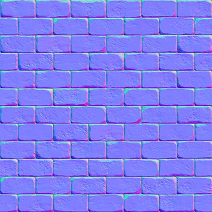
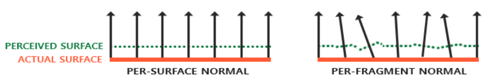
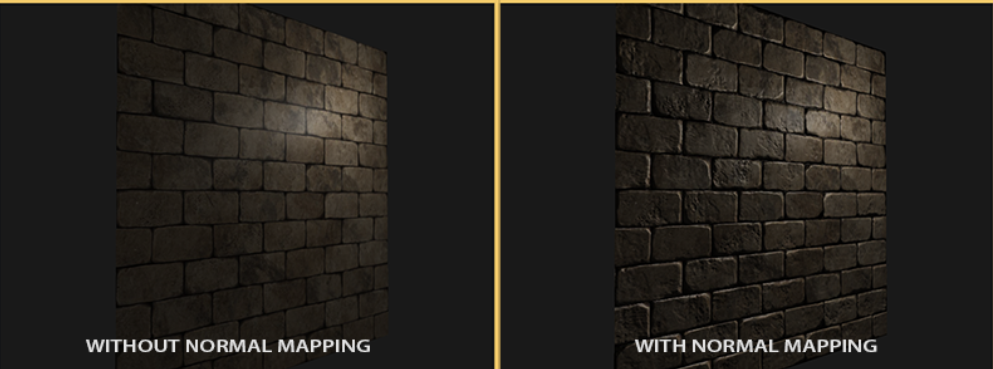

#cg #opengl 

---

**法线贴图 Normal Mapping**

## 什么是法线贴图？

记录了物体表面的法线数据的贴图

纹理一般只存储颜色信息，如rgb代表一个3D向量，而法线也是一个3D向量，所以类似的可以将法线的x、y、z存储到纹理中

**需要注意**
- 法线向量范围：$[-1, 1]$
- 颜色向量范围：$[0, 1]$

所以，在存储之前需要将法线映射到 $[0, 1]$

```c
vec3 rgb_normal = normal * 0.5 + 0.5;
```

法线贴图的一个例子如下图所示：

*呈现出这种特殊的颜色的原因*：
- 所有法线都偏向z轴，即 $(0, 0, 1)$，从而呈现出偏蓝的颜色
- 同时法线还向其他方向轻微偏移，从而出现颜色的变化
  - 例如某些偏绿/偏红的位置

---
## 为什么需要法线贴图？

贴图纹理的作用：
- 给三角形增添额外细节，提升真实感
- 同时能够隐藏多边形几何体是无数三角形组成的事实
然而这种贴图无法反映出物体表面的凹凸层次

**思考**：如何用光照系统来表现出物体表面的深度细节？
- 借助*表面法线向量*



通过某种手段将每个fragment的各自的法线信息，存入一个贴图中，这个贴图就叫做**法线贴图（normal mapping）**或**凹凸贴图（bump mapping）**

应用法线贴图的效果对比：


**注意：**
- 借助法线贴图，我们不再需要使用插值表面法线
- 直接从法线贴图中读取法线数据即可

---
## 怎么实现法线贴图？怎么用法线贴图？

和其他贴图的使用方式类似，

```c
uniform sampelr2D normalMap;

void main()
{
    // 从法线贴图获取法线
    normal = texture(normalMap, fs_in.TexCoords).rgb;
    // 法线范围转换回[-1, 1]
    normal = normalize(normal * 2.0 - 1.0);

    /*
    正常处理光照部分。。。
    */
}
```


